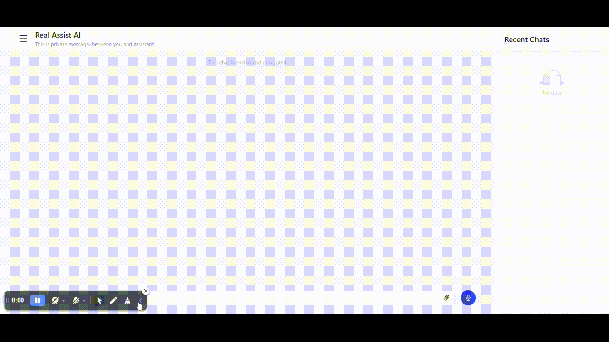

# ChatGPT Example

[Video](./screenshots/1.mp4)

### Frontend

- `create-react-app`
- `redux-toolkit`
- `redux-saga`
- `Ant Design`

### Backend

- `Express`
- `OpenAIAPI`

### Homepage

https://github.com/bcExpt1123/chatgpt-example/blob/main/README.md

### Bugs

https://github.com/bcExpt1123/chatgpt-example/issues

### Author

[bcExpt1123](https://github.com/bcExpt1123)

## How to run project.

### Development 

- backend

  `cd backend`

  `npm i`

  `npm run dev`
  
  or

  `yarn dev`

- frontend

  `cd frontend`

  `npm i`

  `yarn start`

### Production

- backend

  `npm run start`

- frontend

  `npm run build`